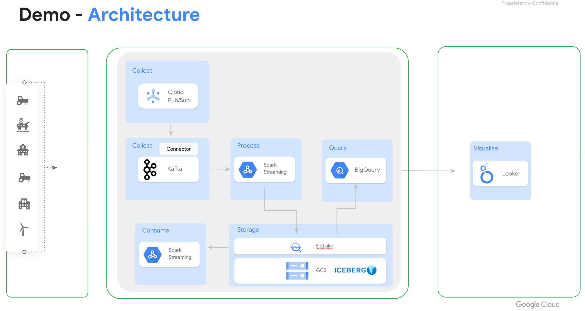

# Open Source Streaming Demo

As part of the streaming analytics solution, we plan to build an open source based stream data ingestion and visibility demo to showcase how the open source technologies can be integrated with the Google native service.

As shown in the diagram below, we have the streaming data written into the Kafka. Then, we consume the Kafka topic using the Spark Streaming, and then write into a BigLake table with Iceberg table format. A query runs every 10 second from Bigquery against the biglake table and sends the result back to a dashboard in Looker.



***Figure 1***

## Dataset

We use a real-time stream of simulated taxi telemetry based on historical ride data taken in New York City from the Taxi & Limousine Commission's [trip record datasets](https://www.nyc.gov/site/tlc/about/tlc-trip-record-data.page). The data is publicly availabe through the Pub/Sub topic.

```json
{
  "ride_id": "7da878a4-37ce-4aa6-a899-07d4054afe96",
  "point_idx": 267,
  "latitude": 40.76561,
  "longitude": -73.96572,
  "timestamp": "2023-07-10T19:00:33.56833-04:00",
  "meter_reading": 11.62449,
  "meter_increment": 0.043537416,
  "ride_status": "enroute",
  "passenger_count": 1
}
```

## Environment variables

Change these varaibles in your environment

```bash
export PROJECT=lufeng-demo
export SUBNET=default
export KAFKA_VM=kafka-2
export CLUSTER_NAME=streaming-demo-cluster
export DATAPROC_BUCKET=lufeng-dataproc-bucket
export WAREHOUSE_DIR=gs://lufeng-us-central1/iceberg
export SA_NAME=lufeng-sa
export CONNECTION=biglake-iceberg
```

## Deploy Kafka and Pub/Sub Kafka connector

We need to install the Kafka service and the Pub/Sub Kafka connector.

### 1. Create a VM 

```bash
gcloud compute instances create ${KAFKA_VM} \
  --project ${PROJECT} \
  --zone us-central1-a \
  --machine-type e2-standard-2 \
  --subnet ${SUBNET} \
  --scopes https://www.googleapis.com/auth/cloud-platform \
  --boot-disk-size 100GB 
```

### 2. Install and configure the Kafka service
You can follow the instruction [here](https://kafka.apache.org/quickstart) or below script to install the Kafka service

ssh into the Kafka VM, and execute the following script
```bash
# install openjdk
sudo apt install default-jre

# download the kafka package
wget https://dlcdn.apache.org/kafka/3.5.0/kafka_2.13-3.5.0.tgz
tar -xzf kafka_2.13-3.5.0.tgz

cd kafka_2.13-3.5.0/

# Start the ZooKeeper service
nohup bin/zookeeper-server-start.sh config/zookeeper.properties > zk.log 2>&1 &

# Start the Kafka broker service
nohup bin/kafka-server-start.sh config/server.properties > broker.log 2>&1 &

# Create a Topic 
bin/kafka-topics.sh --create --topic taxi-events --bootstrap-server localhost:9092
```

you can test the kafka using the following script(optional)

```bash
# Create a Topic 
bin/kafka-topics.sh --create --topic quickstart-events --bootstrap-server localhost:9092

# Publish some message
bin/kafka-console-producer.sh --topic quickstart-events --bootstrap-server localhost:9092

# Consume the message
bin/kafka-console-consumer.sh --topic quickstart-events --from-beginning --bootstrap-server localhost:9092
```

